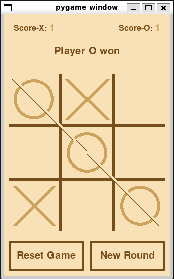

# Tic-Tac-Toe

<p align="center">
   
</p>

A simple Tic-Tac-Toe game that allows 2 players to play against each other and keeps track of their scores. The whole process of building this game can be found in this <a href="https://dev.to/cookiemonsterdev/tic-tac-toe-game-with-pygame-26lm-temp-slug-6564228">article</a>

## Quick Start

1. **Install dependencies:**

   ```bash
   make init
   ```

2. **Run the game locally:**

   ```bash
   make start
   ```

3. **Build the game:**

   ```bash
   make build
   ```


